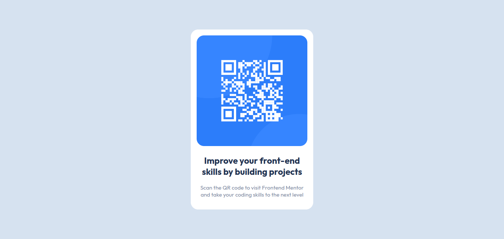

# Frontend Mentor - QR code component solution

This is a solution to the [QR code component challenge on Frontend Mentor](https://www.frontendmentor.io/challenges/qr-code-component-iux_sIO_H). Frontend Mentor challenges help you improve your coding skills by building realistic projects. 

## Table of contents

- [Overview](#overview)
  - [Screenshot](#screenshot)
- [My process](#my-process)
  - [Built with](#built-with)
  - [What I learned](#what-i-learned)
  - [Continued development](#continued-development)
- [Author](#author)

## Overview

This project is about a qr-code center in the page.

### Screenshot

## My process

This project is very short, I did this exercise in less than 40 minutes, it was a little complicated for me to center the container but I was able to overcome it.

### Built with

- Semantic HTML5 markup
- CSS custom properties
- Flexbox

### What I learned

I learn how to center a container, I have read some comments about centering a div in the comments of my previous frontend mentor developers so this time I have centered the container well.

### Continued development

I want to continue learning about responsive design.

## Author

I haven't a web page.
